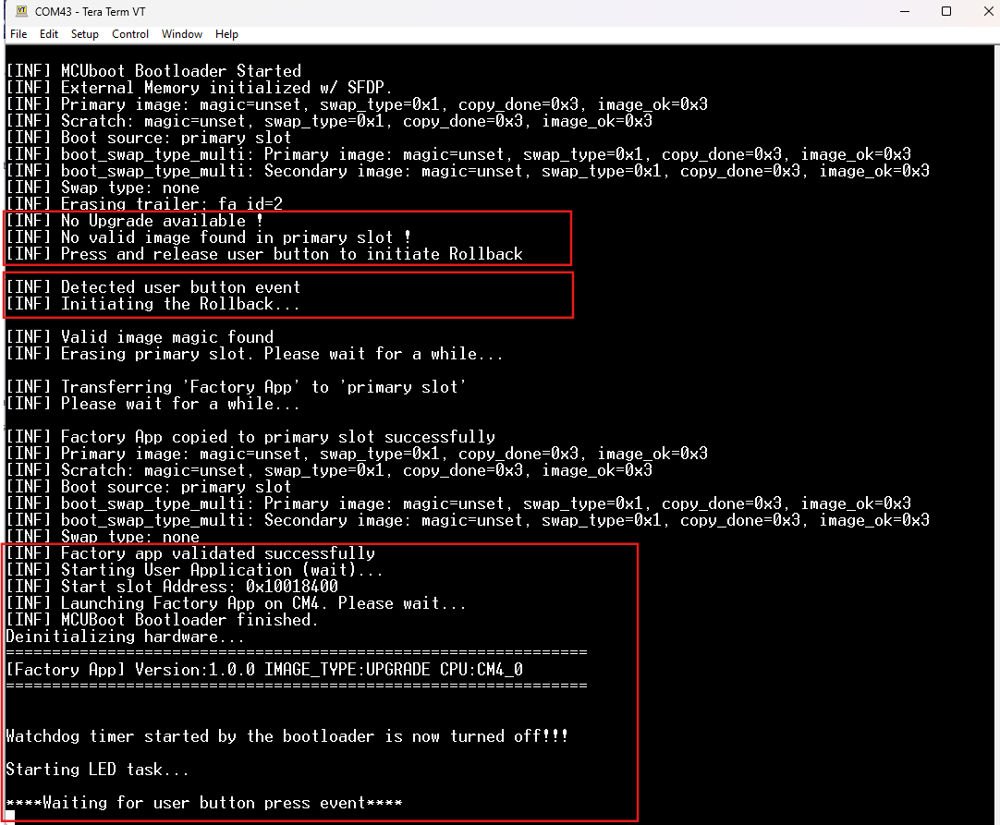
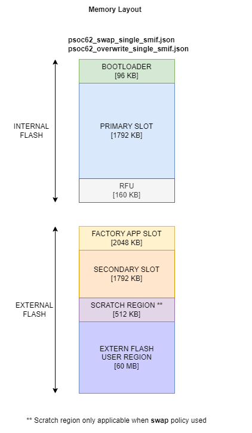

# PSoC&trade; 6 MCU: MCUboot-based bootloader with rollback to factory app

This code example implements a bootloader based on [MCUboot](https://mcu-tools.github.io/mcuboot/) to demonstrate ‘Rollback’ to a known good image ("factory_app_cm4") in case of unrecoverable error conditions in the current application.

In this example, the bootloader can load the factory application from a known location in the external memory by directly copying it into the primary slot in the internal flash, based on user inputs during boot. The factory app can then perform the OTA upgrade to download an image over Wi-Fi and place it to the secondary slot of MCUboot.

This code example includes the following applications:

- **bootloader_cm0p:** The bootloader is a tiny application based on [MCUboot](https://mcu-tools.github.io/mcuboot/). This is the first application to start on every reset, and runs entirely on the CM0+ CPU. It is responsible for validating and authenticating the firmware images in the primary and secondary slots, performing necessary upgrades, and booting the CM4 CPU. The *bootloader* determines the application to run on the CM4 CPU (*blinky_cm4* or *factory_app_cm4*) depending on the state of the primary slot and user events. If you are new to MCUboot, you can try the [MCUboot-based basic bootloader](https://github.com/Infineon/mtb-example-psoc6-mcuboot-basic) example first to understand the basics.

- **blinky_cm4:** This application is designed to run on the CM4 CPU. At present, this is a tiny application that blinks the LED at different rates based on build-time configurations. On successful build, a binary file is generated, which is used to demonstrate OTA firmware upgrades.

- **factory_app_cm4:** The factory application is a 'golden image' that *bootloader_cm0p* can always trust and fall back on. It is built to run from the internal flash on CM4. During build, this firmware image is built to be placed in the external flash. The bootloader application transfers it to the primary slot for execution. See [Design and implementation](#design-and-implementation).

## Requirements

- [ModusToolbox&trade; software](https://www.infineon.com/modustoolbox) v3.0 or later (tested with v3.0)

- Programming language: C

- [CYPRESS&trade; Programmer](https://www.infineon.com/cms/en/design-support/tools/programming-testing/psoc-programming-solutions/)

- [Mosquitto MQTT broker](https://mosquitto.org/download/)

- Associated parts: All [PSoC&trade; 6 MCU](https://www.infineon.com/cms/en/product/microcontroller/32-bit-psoc-arm-cortex-microcontroller/psoc-6-32-bit-arm-cortex-m4-mcu/) parts

- Associated libraries:
  - [ota-update](https://github.com/Infineon/ota-update)

  - [MCUboot](https://github.com/mcu-tools/mcuboot#v1.8.1-cypress#$$ASSET_REPO$$/mcuboot/v1.8.1-cypress)

## Supported toolchains (make variable 'TOOLCHAIN')

- GNU Arm® Embedded Toolchain v10.3.1 (`GCC_ARM`) - Default value of `TOOLCHAIN`

## Supported kits (make variable 'TARGET')

This example requires PSoC&trade; 6 MCU devices with at least 2-MB flash and 1-MB SRAM, and therefore supports only the following kits:

- [PSoC&trade; 6 Wi-Fi Bluetooth&reg; prototyping kit](https://www.infineon.com/cms/en/product/evaluation-boards/cy8cproto-062-4343w/) (`CY8CPROTO-062-4343W`) - Default target

- [PSoC&trade; 62S2 Wi-Fi Bluetooth&reg; pioneer kit](https://www.infineon.com/cms/en/product/evaluation-boards/cy8ckit-062s2-43012/) (`CY8CKIT-062S2-43012`)

## Hardware setup

This example uses the board's default configuration. See the kit user guide to ensure that the board is configured correctly.

**Note:** ModusToolbox&trade; software requires KitProg3. Before using this code example, make sure that the board is upgraded to KitProg3. The tool and instructions are available in the [Firmware Loader](https://github.com/Infineon/Firmware-loader) GitHub repository.

If you do not upgrade, you will see an error like "unable to find CMSIS-DAP device" or "KitProg firmware is out of date".

## Software setup

1. Install a terminal emulator if you do not have one. Instructions in this document use [Tera Term](https://ttssh2.osdn.jp/index.html.en).

2. Install a Python interpreter. This code example is tested with [Python 3.8.3](https://www.python.org/downloads/release/python-383/).

## Using the code example

Create the project and open it using one of the following:

<details><summary><b>In Eclipse IDE for ModusToolbox&trade; software</b></summary>

1. Click the **New Application** link in the **Quick Panel** (or, use **File** > **New** > **ModusToolbox&trade; Application**). This launches the [Project Creator](https://www.infineon.com/ModusToolboxProjectCreator) tool.

2. Pick a kit supported by the code example from the list shown in the **Project Creator - Choose Board Support Package (BSP)** dialog.

   When you select a supported kit, the example is reconfigured automatically to work with the kit. To work with a different supported kit later, use the [Library Manager](https://www.infineon.com/ModusToolboxLibraryManager) to choose the BSP for the supported kit. You can use the Library Manager to select or update the BSP and firmware libraries used in this application. To access the Library Manager, click the link from the **Quick Panel**.

   You can also just start the application creation process again and select a different kit.

   If you want to use the application for a kit not listed here, you may need to update the source files. If the kit does not have the required resources, the application may not work.

3. In the **Project Creator - Select Application** dialog, choose the example by enabling the checkbox.

4. (Optional) Change the suggested **New Application Name**.

5. The **Application(s) Root Path** defaults to the Eclipse workspace which is usually the desired location for the application. If you want to store the application in a different location, you can change the *Application(s) Root Path* value. Applications that share libraries should be in the same root path.

6. Click **Create** to complete the application creation process.

For more details, see the [Eclipse IDE for ModusToolbox&trade; software user guide](https://www.infineon.com/MTBEclipseIDEUserGuide) (locally available at *{ModusToolbox&trade; software install directory}/docs_{version}/mt_ide_user_guide.pdf*).

</details>

<details><summary><b>In command-line interface (CLI)</b></summary>

ModusToolbox&trade; software provides the Project Creator as both a GUI tool and the command line tool, "project-creator-cli". The CLI tool can be used to create applications from a CLI terminal or from within batch files or shell scripts. This tool is available in the *{ModusToolbox&trade; software install directory}/tools_{version}/project-creator/* directory.

Use a CLI terminal to invoke the "project-creator-cli" tool. On Windows, use the command line "modus-shell" program provided in the ModusToolbox&trade; software installation instead of a standard Windows command-line application. This shell provides access to all ModusToolbox&trade; software tools. You can access it by typing `modus-shell` in the search box in the Windows menu. In Linux and macOS, you can use any terminal application.

This tool has the following arguments:

Argument | Description | Required/optional
---------|-------------|-----------
`--board-id` | Defined in the `<id>` field of the [BSP](https://github.com/Infineon?q=bsp-manifest&type=&language=&sort=) manifest | Required
`--app-id`   | Defined in the `<id>` field of the [CE](https://github.com/Infineon?q=ce-manifest&type=&language=&sort=) manifest | Required
`--target-dir`| Specify the directory in which the application is to be created if you prefer not to use the default current working directory | Optional
`--user-app-name`| Specify the name of the application if you prefer to have a name other than the example's default name | Optional

<br>

The following example clones the "[mtb-example-psoc6-mcuboot-basic](https://github.com/Infineon/mtb-example-psoc6-mcuboot-basic)" application with the desired name "Psoc6Mcuboot" configured for the *CY8CPROTO-062-4343W* BSP into the specified working directory, *C:/mtb_projects*:

   ```
   project-creator-cli --board-id CY8CPROTO-062-4343W --app-id mtb-example-psoc6-mcuboot-basic --user-app-name Psoc6Mcuboot --target-dir "C:/mtb_projects"
   ```

**Note:** The project-creator-cli tool uses the `git clone` and `make getlibs` commands to fetch the repository and import the required libraries. For details, see the "Project creator tools" section of the [ModusToolbox&trade; software user guide](https://www.infineon.com/ModusToolboxUserGuide) (locally available at *{ModusToolbox&trade; software install directory}/docs_{version}/mtb_user_guide.pdf*).

To work with a different supported kit later, use the [Library Manager](https://www.infineon.com/ModusToolboxLibraryManager) to choose the BSP for the supported kit. You can invoke the Library Manager GUI tool from the terminal using the `make library-manager` command or use the Library Manager CLI tool "library-manager-cli" to change the BSP.

The "library-manager-cli" tool has the following arguments:

Argument | Description | Required/optional
---------|-------------|-----------
`--add-bsp-name` | Name of the BSP that should be added to the application | Required
`--set-active-bsp` | Name of the BSP that should be as active BSP for the application | Required
`--add-bsp-version`| Specify the version of the BSP that should be added to the application if you do not wish to use the latest from manifest | Optional
`--add-bsp-location`| Specify the location of the BSP (local/shared) if you prefer to add the BSP in a shared path | Optional

<br>

Following example adds the CY8CPROTO-062-4343W BSP to the already created application and makes it the active BSP for the app:

   ```
   library-manager-cli --project "C:/mtb_projects/Psoc6Mcuboot" --add-bsp-name CY8CPROTO-062-4343W --add-bsp-version "latest-v4.X" --add-bsp-location "local"

   library-manager-cli --project "C:/mtb_projects/Psoc6Mcuboot" --set-active-bsp APP_CY8CPROTO-062-4343W
   ```

</details>

<details><summary><b>In third-party IDEs</b></summary>

Use one of the following options:

- **Use the standalone [Project Creator](https://www.infineon.com/ModusToolboxProjectCreator) tool:**

   1. Launch Project Creator from the Windows Start menu or from *{ModusToolbox&trade; software install directory}/tools_{version}/project-creator/project-creator.exe*.

   2. In the initial **Choose Board Support Package** screen, select the BSP, and click **Next**.

   3. In the **Select Application** screen, select the appropriate IDE from the **Target IDE** drop-down menu.

   4. Click **Create** and follow the instructions printed in the bottom pane to import or open the exported project in the respective IDE.

<br>

- **Use command-line interface (CLI):**

   1. Follow the instructions from the **In command-line interface (CLI)** section to create the application.

   2. Export the application to a supported IDE using the `make <ide>` command.

   3. Follow the instructions displayed in the terminal to create or import the application as an IDE project.

For a list of supported IDEs and more details, see the "Exporting to IDEs" section of the [ModusToolbox&trade; software user guide](https://www.infineon.com/ModusToolboxUserGuide) (locally available at *{ModusToolbox&trade; software install directory}/docs_{version}/mtb_user_guide.pdf*).

</details>


## Operation

This document expects you to be familiar with MCUboot and its concepts. See [MCUboot documentation](https://www.mcuboot.com/documentation/) to learn more.

This example bundles three applications: the bootloader app run by CM0+, the factory app, and the Blinky app run by CM4. You need to build and program the applications in the following order. Do not start building the applications yet: follow the [Step-by-step instructions](#step-by-step-instructions).

1. **Build and program the Bootloader app** - On the next reset, CM0+ runs the bootloader app and prints a message that no valid image has been found.

2. **Connect publisher client to MQTT broker** - By default, the *publisher.py* script is written to connect with the local MQTT broker in non-TLS mode using an IP address. Follow the instructions from [Setting up the MQTT publisher script](#setting-up-the-mqtt-publisher-script) to connect the publisher client to the MQTT broker.

3. **Build and program the factory app to external flash** - By default, the *factory_app_cm4* application is built for the external flash. Follow the bootloader instructions on the console to initiate a rollback using the user button.

4. **Build the Blinky app in UPGRADE mode (default)** - A binary will be generated on successful build, which will be used for OTA upgrade demonstration.

5. **Perform OTA upgrade to boot to Blinky app** - Edit the *ota_update.json* file to modify the value of `Version` to `1.1.0`. The factory app now finds the updated job document, downloads the new image, and places it in the secondary slot. Once the download is complete, a soft reset is issued. The MCUboot bootloader starts the image upgrade process.

## Setting up the local MQTT Mosquitto broker

The root directory of the factory application is referred to as *\<factory_app_cm4>* in this document.

This code example uses the locally installable Mosquitto broker that runs on your computer as the default broker. You can also use one of the other public MQTT brokers listed at [public_brokers](https://github.com/mqtt/mqtt.github.io/wiki/public_brokers).

1. Download the executable setup from the [Mosquitto downloads](https://mosquitto.org/download/) site.

2. Run the setup to install the software. During installation, uncheck the **Service** component. Also, note down the installation directory.

3. Once the installation is complete, add the installation directory to the system `PATH`.

4. Open a CLI terminal.

   On Linux and macOS, you can use any terminal application. On Windows, open the **modus-shell** app from the Start menu.

5. Navigate to the *\<factory_app_cm4>/scripts/* folder.

6. Execute the following command to generate self-signed SSL certificates and keys. On Linux and macOS, you can get your device local IP address by running the `ifconfig` command on any terminal application. On Windows, run the `ipconfig` command on a command prompt.


   ```
   sh generate_ssl_cert.sh <local-ip-address-of-your-pc>
   ```

   Example:
   ```
   sh generate_ssl_cert.sh 192.168.0.10
   ```

   This step will generate the following files in the same *\<factory_app_cm4>/scripts/* directory:

   1. *mosquitto_ca.crt* - Root CA certificate
   2. *mosquitto_ca.key* - Root CA private key
   3. *mosquitto_server.crt* - Server certificate
   4. *mosquitto_server.key* - Server private key
   5. *mosquitto_client.crt* - Client certificate
   6. *mosquitto_client.key* - Client private key

7. The *\<factory_app_cm4>/scripts/mosquitto.conf* file is pre-configured for starting the Mosquitto server for this code example. You can edit the file if you wish to make other changes to the broker settings.

8. Starting the Mosquitto MQTT server:

   - **Using the code example in TLS mode (default):**

      1. Execute the following command:

         ```
         mosquitto -v -c mosquitto.conf
         ```

   - **Using the code example in non-TLS mode:**

      1. Edit the *\<factory_app_cm4>/scripts/mosquitto.conf* file and change the value of the `require_certificate` parameter to `false`.

      2. Execute the following command:

         ```
         mosquitto -v -c mosquitto.conf
         ```

## Setting up the MQTT publisher script

1. Open a CLI terminal.

   On Linux and macOS, you can use any terminal application. On Windows, open the **modus-shell** app from the Start menu.

2. Navigate to the *\<factory_app_cm4>/scripts/* folder.

3. Run the following command to ensure that the required Python modules are installed or already present ("Requirement already satisfied:" is printed).

      ```
      pip install -r requirements.txt
      ```

4. Edit the *\<factory_app_cm4>/scripts/publisher.py* file and change the value of the `MOSQUITTO_BROKER_LOCAL_ADDRESS` variable to the local IP address of your PC.

5. Run the *publisher.py* Python script.

   The script takes arguments such as the kit name, broker URL, and file path. For details on the supported arguments and their usage, execute the following command.

   ```
   python publisher.py --help
   ```

   To start the publisher script for the default settings of this example, execute the following command:

   ```
   python publisher.py tls
   ```
   **Note:** The publisher script does not support non-TLS mode in the local Mosquitto MQTT server. You can always use the publisher script in TLS mode.


### Step-by-step instructions

The *bootloader_cm0p* app design is based on MCUboot, which uses the [imgtool](https://pypi.org/project/imgtool/) Python module for image signing and key management.

1. Connect the board to your PC using the provided USB cable through the KitProg3 USB connector. Open a terminal program and select the KitProg3 COM port. Set the serial port parameters to 8N1 and 115200 baud.

2. The bootloader, factory app, and Blinky app must have the same understanding of the memory layout. The memory layout is defined through JSON files. The *\<bootloader_cm0p>/flashmap* folder provides a set of predefined JSON files that can be readily used. All applications must use the same JSON file.

   Target      | Supported JSON files
   ----------- |----------------------------------
   CY8CPROTO-062-4343W <br> CY8CKIT-062S2-43012  | Both targets support the following flashmaps: <br> *psoc62_swap_single.json* <br> *psoc62_swap_single_smif.json* <br> *psoc62_overwrite_single.json* <br> *psoc62_overwrite_single_smif.json*

   <br>

3. Modify the value of the `FLASH_MAP` variable in *\<bootloader_cm0p>/shared_config.mk* to the selected JSON file name from the previous step.

4. Build and program the bootloader application.

   - **Using Eclipse IDE for ModusToolbox&trade; software:**

      1. Select the *bootloader_cm0p* application in the Project Explorer.

      2. Open the Makefile and change `EN_XMEM_PROG=1` to enable external memory programming abilities in the bootloader. See [PSoC&trade; 6 programming specifications](https://www.infineon.com/dgdl/Infineon-PSoC_6_Programming_Specifications-Programming+Specifications-v12_00-EN.pdf?fileId=8ac78c8c7d0d8da4017d0f66d9bf5627) for more details.

      3. In the **Quick Panel**, scroll down, and click **\<Application Name> Program (KitProg3)**.

   - **Using CLI:**

     From the terminal, export by running the following command to enable the external memory programming abilities in the bootloader.

     ```
     export EN_XMEM_PROG=1
     ```

     Go to the *bootloader_cm0p* directory and execute the `make program_proj` command to build and program the application using the default toolchain to the default target.

     You can specify a target and toolchain manually using the following command:
      ```
      make program_proj TARGET=<BSP> TOOLCHAIN=<toolchain>
      ```

      Example:
      ```
      make program_proj TARGET=CY8CPROTO-062-4343W TOOLCHAIN=GCC_ARM
      ```
     After programming, the *bootloader* application starts automatically. Confirm that the UART terminal displays the following message.

     Note that both secondary and external memory slots do not contain any valid image at this stage.

     **Figure 1. Bootloader starting with no bootable image**

     

5. Set up the MQTT broker and connect the publisher client to the broker from [Setting up the local MQTT mosquitto broker](#setting-up-the-local-mqtt-mosquitto-broker) and [Setting up the MQTT publisher script](#setting-up-the-mqtt-publisher-script) to connect the publisher client to the MQTT broker.

6. Edit the *\<Factory App>/source/ota_app_config.h* file to configure your *factory_app_cm4* image:

    1. Modify the connection configuration `WIFI_SSID`, `WIFI_PASSWORD`, and `WIFI_SECURITY` macros to match the settings of your Wi-Fi network. Make sure that the device running the MQTT broker and the kit are connected to the same network.

    2. Modify the value of `MQTT_BROKER_URL` to the local IP address of your MQTT broker.

    3. By default, this code example works in TLS mode. To use the example in non-TLS mode, modify `ENABLE_TLS` to `false` and skip the next steps for adding the certificates.

    4. Open a CLI terminal.

        On Linux and macOS, you can use any terminal application. On Windows, open the **modus-shell** app from the Start menu.

    5. Navigate the terminal to *\<Factory App>/scripts/* directory.

    6. Run the *format_cert_key.py* Python script to generate the string format of the certificate and key files that can be added as a macro. Pass the name of the certificate or key with the extension as an argument to the Python script:

         ```
         python format_cert_key.py <one-or-more-file-name-of-certificate-or-key-with-extension>
         ```

         Example:
         ```
         python format_cert_key.py mosquitto_ca.crt mosquitto_client.crt mosquitto_client.key
         ```
    7. Copy the generated strings and add it to the `ROOT_CA_CERTIFICATE`, `CLIENT_CERTIFICATE`, and `CLIENT_KEY` macros per the sample shown in the *ota_app_config.h* file.

7. Edit the job document (*\<OTA Application>/scripts/ota_update.json*):

    1. Modify the value of `Broker` to match the IP address of your MQTT broker.

    2. Modify the value of `Board` to match the kit you are using.

    3. In Step 6, if the code example has been configured to work in non-TLS mode, set the value of `Port` to `1883`.

8. Build and program the factory application to the external flash.

   <details><summary><b>Using Eclipse IDE for ModusToolbox&trade; software</b></summary>

      1. Select the application project in the Project Explorer.

      2. In the **Quick Panel**, scroll down, and click **\<Application Name> Program (KitProg3_MiniProg4)**.
   </details>

   <details><summary><b>Using CLI</b></summary>

     From the terminal, execute the `make program` command to build and program the application using the default toolchain to the default target. You can specify a target and toolchain manually:
      ```
      make program_proj TARGET=<BSP> TOOLCHAIN=<toolchain>
      ```

      Example:
      ```
      make program_proj TARGET=CY8CPROTO-062-4343W TOOLCHAIN=GCC_ARM
      ```
   </details>

    **Note:** You can use DAPLink to program the external memory if you haven't enabled `EN_XMEM_PROG`. For  details, see [ExternalMemory.md](https://github.com/mcu-tools/mcuboot/blob/master/boot/cypress/MCUBootApp/ExternalMemory.md).

9. Initiate rollback to the factory app.

   At this point, both the primary and secondary slots are empty. The bootloader reports that both slots are empty and waits for the user's action, as shown in Figure 1.

   Press and release the user button to initiate rollback.

   The bootloader detects the *factory_app_cm4* application in the external flash, copies it to the primary slot, and validates and starts the application on CM4. On successful boot, the *factory_app_cm4* application will boot to the console and start blinking the user LED at a 1-Hz rate.

   **Figure 2. Rollback to *factory_app_cm4* when both primary and secondary slots are empty**

   

8. Build the Blinky application in UPGRADE mode (**DO NOT** program it to the kit).

   <details><summary><b>Using Eclipse IDE for ModusToolbox&trade; software</b></summary>

      Note that `IMG_TYPE` is set to `UPGRADE` by default in *blinky_cm4/Makefile*.

      1. Select the `blinky_cm4` application in the Project Explorer.

      2. In the **Quick Panel**, scroll down, and click **\<Application Name> Build (KitProg3)**.

   </details>

   <details><summary><b>Using CLI</b></summary>

     From the terminal, go to the *blinky_cm4* directory and execute the `make build_proj` command. You can specify a target and toolchain manually using the following command:
      ```
      make build_proj TARGET=<BSP> TOOLCHAIN=<toolchain>
      ```

      Example:
      ```
      make build_proj TARGET=CY8CPROTO-062-4343W TOOLCHAIN=GCC_ARM
      ```
   </details>

      **Note:** The binary file *<APPNAME>.bin* generated at the end of a successful build will be used in subsequent steps for OTA upgrade.

11. Download the Blinky application to the bootloader's secondary slot (using the OTA capabilities of the factory application).

    After a successful build, edit the *<factory_app_cm4>/scripts/ota_update.json* file to modify the value of version to 1.1.0.

    The factory application starts blinking the user LED at a 1-second interval on bootup and waits for the user button event to start the OTA upgrade process. Press and release the user button to start the OTA upgrade process.

    When a user button press is detected, the device establishes a connection with the designated MQTT broker ([Eclipse Mosquitto](https://mosquitto.org/) is used in this example) and subscribes to a topic. When an OTA image is published to that topic, the device automatically pulls the OTA image over MQTT and saves it to the secondary slot.

    **Figure 3. Factory app ready for OTA upgrade**

    

    Observe the UART terminal to see the OTA image being received in chunks.

    **Figure 4. Receiving a new firmware image**

    

   Once all chunks are received and written to the secondary slot, the factory app will reset the device. On reset, the bootloader will verify the new image in the secondary slot, copy it to the primary slot, and boot the newly downloaded Blinky app. To confirm the swap of the upgrade image from the secondary slot into the primary slot and make it the primary image, enter Y in the UART terminal. To revert to the original image, enter N. Confirm that the user LED toggles at the 250-millisecond interval. On every reset, the *bootloader* app will start the user application in the primary slot, as long as it is valid.

## Developer notes

Do **NOT** write/erase the external memory region allocated to store *factory_app_cm4*. If the factory app is erased from the external flash, the bootloader will detect and report an error to the user on the next rollback attempt.

## Debugging

You can debug the example to step through the code. In the IDE, use the **\<Application Name> Debug (KitProg3_MiniProg4)** configuration in the **Quick Panel**. For more details, see the "Program and Debug" section in the Eclipse IDE for ModusToolbox&trade; software user guide: *{ModusToolbox&trade; install directory}/ide_{version}/docs/mt_ide_user_guide.pdf*.


## Design and implementation

### Overview

This example bundles three applications: the bootloader app, the Blinky app, and the factory app. By default, the Blinky app is built in UPGRADE mode to demonstrate the OTA upgrade process. The factory app is built to be placed in the external memory and copied to the internal flash on rollback; it executes entirely from the internal flash. It supports the [OTA](https://github.com/Infineon/ota-update) process; you can trigger the OTA upgrade as described in [Step-by-step instructions](#step-by-step-instructions).

### Bootloader implementation

The bootloader is designed based on the MCUboot repo in [GitHub](https://github.com/mcu-tools/mcuboot#v1.8.1-cypress#$$ASSET_REPO$$/mcuboot/v1.8.1-cypress). It is customized in this example to support the rollback feature. Details of the design are provided in the following sections. The bootloader supports both overwrite and swap modes.

**Figure 5. bootloader_cm0p implementation overview**


#### **Rollback when both primary and secondary slots are invalid**

On bootup, the bootloader checks both primary and secondary slots and determines whether a valid image is present. If both slots are empty or invalid, the bootloader displays a message on the console that there are no valid images in either slot.

You can press and release the user button to initiate the rollback as instructed in Step 9 (initiate rollback to the factory app) in the [Step-by-step instructions](#Step-by-step instructions) section.

#### **Rollback when primary slot is valid but secondary slot is invalid**

If the primary slot is valid and no upgradable image is present in the secondary slot, on reset, the bootloader boots to the primary slot.  Instead of booting the application, press and hold the user button during the boot until the 'Rollback Initiated' message is seen on the console to initiate a rollback.

If the device has already booted to the application in the primary slot, you can initiate rollback by holding the user button pressed and then initiating a reset. In both cases, you must hold the user button pressed during the boot for approximately 5 seconds until you observe the 'Rollback Initiated' message on the console.


#### **Rollback when secondary slot has a valid upgradable image**

By design, an upgrade always gets priority over a rollback request. The bootloader will run the upgrade process first. User events are ignored during the upgrade process.

However, at the end of the upgrade process (before booting to the new image), the bootloader will check the user button status to determine if a rollback is requested. Rollback will be initiated if the user button is held pressed.

#### **Recovering from power failure during rollback**

The bootloader application provides a built-in recovery mechanism from power failure. It validates the primary slot on every reset and reports the status via console messages. If the bootloader reports no valid images, the device can be restored back to its functional state by initiating a rollback. See [Rollback when both primary and secondary slots are invalid](#rollback-when-both-primary-and-secondary-slots-are-invalid).

Figure 6 shows the console messages: messages in the highlighted text boxes indicate power failure and MCU reset while copying the *factory_app_cm4* image to the primary slot. These messages indicate that on the next boot, a rollback was initiated with a user button event.

**Figure 6. Power failure during rollback**


### Blinky app implementation

This is a tiny application that simply blinks the user LED on startup. The LED blink interval is configured based on the `IMG_TYPE` specified. By default, `IMG_TYPE` is set to `UPGRADE` to generate suitable binaries for upgrade. The bootloader upgrade image is in overwrite mode in this case; the LED toggles at a 250-millisecond interval. The bootloader upgrade image is the swap mode upgrade image from the secondary slot into the primary slot and make it the primary image, enter **Y** in the UART terminal. To revert to the original image, enter **N**. Confirm that the user LED toggles at the 250-millisecond interval.

The image will be signed using the `keys` available in *bootloader_cm0p/keys*. It is possible to build the Blinky application as a `BOOT` image and program it to the primary slot directly (not discussed in this document).

### Factory app implementation

The factory application uses the [ota-update](https://github.com/Infineon/ota-update) middleware; it performs an OTA upgrade using the MQTT protocol. The application connects to the MQTT server and receives the OTA upgrade package, if available. The OTA upgrade image will be downloaded to the secondary slot of MCUboot in chunks. Once the complete image is downloaded, the application issues an MCU reset. On reset, the bootloader starts and handles the rest of the upgrade process.

The factory app is signed using the `keys` available under *bootloader_cm0p/keys* to ensue that the bootloader boots it safely. This process detects malicious firmware or possible corruptions early in the boot process.

**Figure 7. factory_app_cm4 implementation overview**


### Memory layout in PSoC&trade; 6 MCU with 2-MB flash

The development kit has a 2-MB internal flash and a 64-MB external flash, which is partitioned into the following regions:

|Region <br /> <br /> <br />              | Size <br /> *psoc62_swap_single_smif.json* *psoc62_overwrite_single_smif.json* | Size <br /> *psoc62_swap_single.json* *psoc62_overwrite_single.json* | Description
|---------------------|-------------|----------|--------
|Bootloader partition | 96 KB | 96 KB | Partition is the first region in the internal flash memory that holds *bootloader_cm0p*.
|Primary partition    | 1792 KB | 952 KB | Partition where the bootable application is placed. Primary boot slot of *bootloader_cm0p*.
|Secondary partition  | 1792 KB | 952 KB | Partition where the downloaded OTA upgrade image will be placed. Secondary slot of *bootloader_cm0p*.
|Scratch Region **          | 512 KB | 4 KB | Region used for swapping image. Only applicable when *swap* policy is used.
|RFU                  | 160 KB | 44 KB | Region reserved for future use.
|Factory app reserved | First 2 MB in external flash | First 1 MB in external flash | Region reserved for *factory_app_cm4*. Although the maximum size of the factory application cannot exceed the primary slot size, additional 72 KB (1 MB – 952 KB) is allocated to align with the erase sector size of the QSPI flash (S25FL512S).
|User region            | 60 MB | 63 MB | Region for application use.

**Figure 8. Memory layout**



### Make variable default configuration

This section explains the important make variables that affect this code example's functionality. You can either update these variables directly in the Makefile or pass them along with the `make build` command.

#### **Common make variables**

| Variable                  | Default value        | Description
| --------------------------| -------------------- |----------------------------------------------------------------------------------- |
| `SIGN_KEY_FILE`           | cypress-test-ec-p256 | Name of the private and public key files (the same name is used for both the keys). |
| `BOOTLOADER_SIZE`           | Autogenerated       | Flash size of the bootloader app run by CM0+. <br>In the linker script for the bootloader app (CM0+), the `LENGTH` of the `flash` region is set to this value.<br>In the linker script for the Blinky app (CM4), the `ORIGIN` of the `flash` region is offset to this value. |
| `BOOTLOADER_APP_RAM_SIZE`   | 0x20000              | RAM size of the *bootloader_cm0p* app run by CM0+. <br>In the linker script for the *bootloader_cm0p* app (CM0+), `LENGTH` of the `ram` region is set to this value.<br>In the linker script for the Blinky app (CM4), `ORIGIN` of the `ram` region is offset to this value and `LENGTH` of the `ram` region is calculated based on this value. |
|  `SLOT_SIZE`                 | Autogenerated       | Size of the primary slot and secondary slot. i.e., flash size of the Blinky app run by CM4. |
|  `MCUBOOT_HEADER_SIZE`       | 0x400                | Size of the MCUboot header. Must be a multiple of 1024 (see the note below).<br>Used in the following places:<br>1. In the linker script for the Blinky app (CM4), the starting address of the`.text` section is offset by the MCUboot header size from the `ORIGIN` of the `flash` region. This is to leave space for the header that will be later inserted by the *imgtool* during the post-build process.  <br>2. Passed to the *imgtool* utility while signing the image. The *imgtool* utility fills the space of this size with zeroes (or 0xff depending on internal or external flash) and then adds the actual header from the beginning of the image. |
| `MCUBOOT_MAX_IMG_SECTORS`           | Autogenerated       | Maximum number of flash sectors (or rows) per image slot for which swap status is tracked in the image trailer.
 `MCUBOOT_IMAGE_NUMBER`      | Autogenerated       | The number of images supported in the case of multi-image bootloading.
 `PRIMARY_IMG_START`         | Autogenerated       | Starting address of the primary slot.
 `SECONDARY_IMG_START`        | Autogenerated       | Starting address of the secondary slot. |
| `FACT_APP_SIZE`             | 0x100000(USE_EXTERNAL_FLASH=0) <br> 0x200000(USE_EXTERNAL_FLASH=1)             | Reserved size for *factory_app_cm4* in the external flash. This size must be the same as `SLOT_SIZE`. However, 1 MB is allocated to make it aligned with the 256-KB sector size of S25FL512S. |
| `EXTERNAL_FLASH_SIZE`       | 0x4000000            | Size of the external flash memory available on the development kit. A 64-MB QSPI NOR flash [S25FL512S](https://www.infineon.com/dgdl/Infineon-S25FL512S_512_Mb_(64_MB)_3.0_V_SPI_Flash_Memory-DataSheet-v19_00-EN.pdf?fileId=8ac78c8c7d0d8da4017d0ed046ae4b53) is used on the kits supported in this CE.

**Note:** The value of `MCUBOOT_HEADER_SIZE` must be a multiple of 1024 because the CM4 image begins immediately after the MCUboot header, and it begins with the interrupt vector table. For PSoC&trade; 6 MCU, the starting address of the interrupt vector table must be 1024-bytes aligned.

#### **bootloader_cm0p make variables**

| Variable               | Default value | Description                                                  |
| ---------------------- | ------------- | ------------------------------------------------------------ |
| `EN_XMEM_PROG`         | 1             | Set it to '1' to enable external memory programming support in the bootloader. See [PSoC&trade; 6 programming specifications](https://www.infineon.com/dgdl/Infineon-PSoC_6_Programming_Specifications-Programming+Specifications-v12_00-EN.pdf?fileId=8ac78c8c7d0d8da4017d0f66d9bf5627) for more details. |
| `USE_OVERWRITE`              | Autogenerated       | Value is '1' when scratch and status partitions are not defined in the flashmap JSON file.
 `USE_EXTERNAL_FLASH`         | Autogenerated       | Value is '1' when external flash is used for either primary or secondary slot.

#### **factory_app_cm4 make variables**

| Variable             | Default value | Description            |
| ---------------------| ------------- | ---------------------- |
| `ERASED_VALUE`         | 0xff          | Factory Application is built for the external flash. Erase value of the external flash (S25FL512S) is 0xFF. Change this value as per your flash.
| `HEADER_OFFSET`        | 0x7FE8000     | Starting address of the CM4 app or the offset at which the header of an image will begin. Image = Header + App + TLV + Trailer. <br>New relocated address = `ORIGIN` + `HEADER_OFFSET`<br>`ORIGIN` is defined in the CM4 linker script and is usually the address next to the end of the CM0+ image. <br>See the table below for the values of `HEADER_OFFSET` for the default flash map. |
| `USE_OVERWRITE`              | Autogenerated       | Value is '1' when scratch and status partitions are not defined in the flashmap JSON file.
 `USE_EXTERNAL_FLASH`         | Autogenerated       | Value is '1' when an external flash is used for either primary or secondary slot.
 `KEY_FILE_PATH` | *../bootloader_cm0p/keys* | Path to the private key file. Used with the *imgtool* for signing the image.
 `APP_VERSION_MAJOR`<br>`APP_VERSION_MINOR`<br>`APP_VERSION_BUILD` | 1.0.0 if `IMG_TYPE=BOOT`<br>2.0.0 if `IMG_TYPE=UPGRADE` | Passed to the *imgtool* with the `-v` option in *MAJOR.MINOR.BUILD* format, while signing the image. Also available as macros to the application with the same names.

#### **blinky_cm4 make variables**

| Variable      | Default value | Description            |
| ------------- | ------------- | ---------------------- |
| `IMG_TYPE`      | UPGRADE       | Valid values are `BOOT` and `UPGRADE`. Default value is set to `UPGRADE` in this code example along with padding. Set it to `BOOT` if you want to flash it directly on to the primary slot instead of upgrading.|
| `HEADER_OFFSET` | Auto-calculated             | The starting address of the CM4 app or the offset at which the header of an image will begin. Value equal to (`SECONDARY_IMG_START` - `PRIMARY_IMG_START`). |
| `USE_OVERWRITE`              | Autogenerated       | Value is '1' when scratch and status partitions are not defined in the flashmap JSON file.
 `USE_EXTERNAL_FLASH`         | Autogenerated       | Value is '1' when an external flash is used for either primary or secondary slot.
 `KEY_FILE_PATH` | *../bootloader_cm0p/keys* | Path to the private key file. Used with the *imgtool* for signing the image.
 `APP_VERSION_MAJOR`<br>`APP_VERSION_MINOR`<br>`APP_VERSION_BUILD` | 1.0.0 if `IMG_TYPE=BOOT`<br>2.0.0 if `IMG_TYPE=UPGRADE` | Passed to the *imgtool* with the `-v` option in *MAJOR.MINOR.BUILD* format, while signing the image. Also available as macros to the application with the same names.

### Security

**Note:** This example simply demonstrates the image-signing feature of MCUboot. It does not implement root of trust (RoT)-based secure services such as secure boot and secure storage (to securely store and retrieve the keys). You must ensure that adequate security measures are implemented in your end product. See the [PSoC&trade; 64 line of secure MCUs](https://www.infineon.com/cms/en/product/microcontroller/32-bit-psoc-arm-cortex-microcontroller/psoc-6-32-bit-arm-cortex-m4-mcu/psoc-64/) that have built-in advanced security features. See the [whitepaper](https://www.infineon.com/dgdlac/Infineon-Security_Comparison_Between_PSoC_64_Secure_MCU_and_PSoC_62_63_MCU-Whitepaper-v01_00-EN.pdf?fileId=8ac78c8c7d0d8da4017d0fb27691270a) that compares the security features between the PSoC&trade; 64 secure MCUs and the PSoC&trade; 62/63 MCUs.

MCUboot checks image integrity with SHA256, and image authenticity with digital signature verification. Multiple signature algorithms are supported; this example enables ECDSA SECP256R1 (EC256) by default. MCUboot uses the Mbed TLS library for cryptography. PSoC&trade; 6 MCU supports hardware-accelerated cryptography based on the Mbed TLS library via a shim layer. The [cy-mbedtls-acceleration](https://github.com/Infineon/cy-mbedtls-acceleration) library implements this layer.

MCUboot verifies the signature of the image in the primary slot every time before booting when `MCUBOOT_VALIDATE_PRIMARY_SLOT` is defined. In addition, it verifies the signature of the image in the secondary slot before copying it to the primary slot.

This example enables image authentication by un-commenting the following lines in the *bootloader_cm0p/libs/mcuboot/boot/cypress/MCUBootApp/config/mcuboot_config/mcuboot_config.h* file:

```
#define MCUBOOT_SIGN_EC256
#define NUM_ECC_BYTES (256 / 8)
.
.
.
#define MCUBOOT_VALIDATE_PRIMARY_SLOT
```

When these options are enabled, the public key is embedded within the bootloader app. The Blinky and factory apps are signed using the private key during the post-build steps. The *imgtool* Python module included in the MCUboot repository is used for signing the image.

This example includes a sample key-pair under the *bootloader_cm0p/keys* directory. **You must not use this key-pair in your end product.**  For more details on key management, see [Image tool](https://www.mcuboot.com/documentation/imgtool/).

### Resources and settings

#### **Bootloader app**

| Resource  |  Alias/Object     |    Purpose     |
| :------- | :------------    | :------------ |
| SCB UART (PDL) |CYBSP_UART| Used for redirecting `printf` to the UART port |
| SMIF (PDL) | QSPIPort | Used for interfacing with the QSPI NOR flash |
| GPIO (HAL)    | CYBSP_USER_BTN         | User button |

#### **Blinky app**

| Resource  |  Alias/Object     |    Purpose     |
| :------- | :------------    | :------------ |
| UART (HAL)|cy_retarget_io_uart_obj| UART HAL object used by Retarget-IO for the debug UART port  |
| GPIO (HAL)    | CYBSP_USER_LED         | User LED |

#### **Factory app**

| Resource  |  Alias/Object     |    Purpose     |
| :------- | :------------    | :------------ |
| UART (HAL)|cy_retarget_io_uart_obj| UART HAL object used by Retarget-IO for the debug UART port  |
| GPIO (HAL)    | CYBSP_USER_LED         | User LED |
| GPIO (HAL)    | CYBSP_USER_BTN         | User button |

## Related resources

Resources  | Links
-----------|----------------------------------
Application notes  | [AN228571](https://www.infineon.com/AN228571) – Getting started with PSoC&trade; 6 MCU on ModusToolbox&trade; software <br>  [AN215656](https://www.infineon.com/AN215656) – PSoC&trade; 6 MCU: Dual-CPU system design <br> [AN221774](https://www.infineon.com/dgdl/Infineon-AN221774_Getting_Started_with_PSoC_6_MCU_on_PSoC_Creator-ApplicationNotes-v07_00-EN.pdf?fileId=8ac78c8c7cdc391c017d0d357e356627) – Getting started with PSoC&trade; 6 MCU on PSoC&trade; Creator <br> [AN210781](https://www.infineon.com/dgdl/Infineon-AN210781_Getting_Started_with_PSoC_6_MCU_with_Bluetooth_Low_Energy_(BLE)_Connectivity_on_PSoC_Creator-ApplicationNotes-v05_00-EN.pdf?fileId=8ac78c8c7cdc391c017d0d311f536528) – Getting started with PSoC&trade; 6 MCU with Bluetooth&reg; Low Energy connectivity on PSoC&trade; Creator
Code examples  | [Using ModusToolbox&trade; software](https://github.com/Infineon/Code-Examples-for-ModusToolbox-Software) on GitHub
Device documentation | [PSoC&trade; 6 MCU datasheets](https://www.infineon.com/cms/en/search.html#!view=downloads&term=psoc6&doc_group=Data%20Sheet) <br> [PSoC&trade; 6 technical reference manuals](https://www.infineon.com/cms/en/search.html#!view=downloads&term=psoc6&doc_group=Additional%20Technical%20Information)
Development kits | Select your kits from the [Evaluation board finder](https://www.infineon.com/cms/en/design-support/finder-selection-tools/product-finder/evaluation-board) page.
Libraries on GitHub  | [mtb-pdl-cat1](https://github.com/Infineon/mtb-pdl-cat1) – PSoC&trade; 6 peripheral driver library (PDL)  <br> [mtb-hal-cat1](https://github.com/Infineon/mtb-hal-cat1) – Hardware abstraction layer (HAL) library <br> [retarget-io](https://github.com/Infineon/retarget-io) – Utility library to retarget STDIO messages to a UART port
Middleware on GitHub  | [MCUboot](https://github.com/mcu-tools/mcuboot) – Open-source library enabling the development of secure bootloader applications for 32-bit MCUs <br> [ota-update](https://github.com/Infineon/ota-update) – OTA library and docs <br> [wifi-mw-core](https://github.com/Infineon/wifi-mw-core) – Wi-Fi middleware core library and docs <br> [capsense](https://github.com/Infineon/capsense) – CAPSENSE&trade; library and documents <br> [psoc6-middleware](https://github.com/Infineon/modustoolbox-software#psoc-6-middleware-libraries) – Links to all PSoC&trade; 6 MCU middleware
Tools  | [Eclipse IDE for ModusToolbox&trade; software](https://www.infineon.com/modustoolbox) – ModusToolbox&trade; software is a collection of easy-to-use software and tools enabling rapid development with Infineon MCUs, covering applications from embedded sense and control to wireless and cloud-connected systems using AIROC&trade; Wi-Fi and Bluetooth® connectivity devices.
<br>

## Other resources

Infineon provides a wealth of data at www.infineon.com to help you select the right device, and quickly and effectively integrate it into your design.

For PSoC&trade; 6 MCU devices, see [How to design with PSoC&trade; 6 MCU - KBA223067](https://community.infineon.com/t5/Knowledge-Base-Articles/How-to-Design-with-PSoC-6-MCU-KBA223067/ta-p/248857) in the Infineon community.

## Document history

Document title: *CE230815* – *PSoC&trade; 6 MCU: MCUboot-based bootloader with rollback to factory app*

 Version | Description of change
 ------- | ---------------------
 1.0.0   | New code example
 2.0.0   | Update to: <br>1. Support anycloud-ota v4.X library <br>2. Use locally installed mosquitto broker
 2.1.0   | Updated to support ModusToolbox™ software v2.4 <br>Fixed minor bugs
 3.0.0   | Updates the example to use mcuboot v1.8.1 and ota-update v2.0.0 library <br> Updated to support ModusToolbox™ software v3.0

<br>

© Cypress Semiconductor Corporation, 2021-2023. This document is the property of Cypress Semiconductor Corporation, an Infineon Technologies company, and its affiliates ("Cypress").  This document, including any software or firmware included or referenced in this document ("Software"), is owned by Cypress under the intellectual property laws and treaties of the United States and other countries worldwide.  Cypress reserves all rights under such laws and treaties and does not, except as specifically stated in this paragraph, grant any license under its patents, copyrights, trademarks, or other intellectual property rights.  If the Software is not accompanied by a license agreement and you do not otherwise have a written agreement with Cypress governing the use of the Software, then Cypress hereby grants you a personal, non-exclusive, nontransferable license (without the right to sublicense) (1) under its copyright rights in the Software (a) for Software provided in source code form, to modify and reproduce the Software solely for use with Cypress hardware products, only internally within your organization, and (b) to distribute the Software in binary code form externally to end users (either directly or indirectly through resellers and distributors), solely for use on Cypress hardware product units, and (2) under those claims of Cypress’s patents that are infringed by the Software (as provided by Cypress, unmodified) to make, use, distribute, and import the Software solely for use with Cypress hardware products.  Any other use, reproduction, modification, translation, or compilation of the Software is prohibited.
<br>
TO THE EXTENT PERMITTED BY APPLICABLE LAW, CYPRESS MAKES NO WARRANTY OF ANY KIND, EXPRESS OR IMPLIED, WITH REGARD TO THIS DOCUMENT OR ANY SOFTWARE OR ACCOMPANYING HARDWARE, INCLUDING, BUT NOT LIMITED TO, THE IMPLIED WARRANTIES OF MERCHANTABILITY AND FITNESS FOR A PARTICULAR PURPOSE.  No computing device can be absolutely secure.  Therefore, despite security measures implemented in Cypress hardware or software products, Cypress shall have no liability arising out of any security breach, such as unauthorized access to or use of a Cypress product. CYPRESS DOES NOT REPRESENT, WARRANT, OR GUARANTEE THAT CYPRESS PRODUCTS, OR SYSTEMS CREATED USING CYPRESS PRODUCTS, WILL BE FREE FROM CORRUPTION, ATTACK, VIRUSES, INTERFERENCE, HACKING, DATA LOSS OR THEFT, OR OTHER SECURITY INTRUSION (collectively, "Security Breach").  Cypress disclaims any liability relating to any Security Breach, and you shall and hereby do release Cypress from any claim, damage, or other liability arising from any Security Breach.  In addition, the products described in these materials may contain design defects or errors known as errata which may cause the product to deviate from published specifications. To the extent permitted by applicable law, Cypress reserves the right to make changes to this document without further notice. Cypress does not assume any liability arising out of the application or use of any product or circuit described in this document. Any information provided in this document, including any sample design information or programming code, is provided only for reference purposes.  It is the responsibility of the user of this document to properly design, program, and test the functionality and safety of any application made of this information and any resulting product.  "High-Risk Device" means any device or system whose failure could cause personal injury, death, or property damage.  Examples of High-Risk Devices are weapons, nuclear installations, surgical implants, and other medical devices.  "Critical Component" means any component of a High-Risk Device whose failure to perform can be reasonably expected to cause, directly or indirectly, the failure of the High-Risk Device, or to affect its safety or effectiveness.  Cypress is not liable, in whole or in part, and you shall and hereby do release Cypress from any claim, damage, or other liability arising from any use of a Cypress product as a Critical Component in a High-Risk Device. You shall indemnify and hold Cypress, including its affiliates, and its directors, officers, employees, agents, distributors, and assigns harmless from and against all claims, costs, damages, and expenses, arising out of any claim, including claims for product liability, personal injury or death, or property damage arising from any use of a Cypress product as a Critical Component in a High-Risk Device. Cypress products are not intended or authorized for use as a Critical Component in any High-Risk Device except to the limited extent that (i) Cypress’s published data sheet for the product explicitly states Cypress has qualified the product for use in a specific High-Risk Device, or (ii) Cypress has given you advance written authorization to use the product as a Critical Component in the specific High-Risk Device and you have signed a separate indemnification agreement.
<br>
Cypress, the Cypress logo, and combinations thereof, WICED, ModusToolbox, PSoC, CapSense, EZ-USB, F-RAM, and Traveo are trademarks or registered trademarks of Cypress or a subsidiary of Cypress in the United States or in other countries. For a more complete list of Cypress trademarks, visit www.infineon.com. Other names and brands may be claimed as property of their respective owners.
