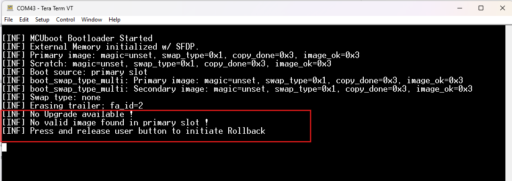

# PSoC 6 MCU: MCUboot-Based Bootloader with Rollback to Factory App in External Flash 

This code example implements a bootloader based on [MCUboot](https://juullabs-oss.github.io/mcuboot/) to demonstrate ‘Rollback’ to a known good image ('factory_app_cm4') in case of unrecoverable error conditions with the application that is currently running. 

In this example, Bootloader can load the factory app from a known location in the external memory by directly copying it into the primary slot in the internal flash, based on user inputs during boot. The factory app can then perform the OTA to download an image over Wi-Fi and place it to the secondary slot of MCUboot. 

This code example includes the following applications:
 
**bootloader_cm0p:** The bootloader is a tiny app based on [MCUboot](https://juullabs-oss.github.io/mcuboot/). This is the first application to start on every reset, and runs entirely on the CM0+ CPU. It is responsible for validating and authenticating the firmware images in the primary and secondary slots, performing necessary upgrades, and booting the CM4 CPU. The *bootloader* decides the application to run on the CM4 CPU (*blinky_cm4* or *factory_app_cm4*) depending on the state of the primary slot and user events. If you are new to MCUboot, you can try the [MCUboot-based Basic Bootloader](https://github.com/cypresssemiconductorco/mtb-example-psoc6-mcuboot-basic) example first to understand the basics.

**blinky_cm4:** This application is designed to run on the CM4 CPU. At present, this is a tiny application that blinks the LED at different rates based on build-time configurations. On successful build, a binary file is generated, which is used to demonstrate OTA firmware upgrades.

**factory_app_cm4:** The factory app is a 'golden image' that *bootloader_cm0p* can always trust and fall back on. It is built to run from the internal flash on CM4. During build, this firmware image is built to be placed in the external flash. The bootloader application transfers it to the primary slot for execution. See [Design and Implementation](#design-and-implementation).

## Requirements

- [ModusToolbox™ software](https://www.cypress.com/products/modustoolbox-software-environment) v2.1

- Programming Language: C

- [Cypress Programmer](https://www.cypress.com/products/psoc-programming-solutions) 

- Associated Parts: All [PSoC® 6 MCU](http://www.cypress.com/PSoC6) parts

- Associated libraries: 
  - [AnyCloud OTA](https://github.com/cypresssemiconductorco/anycloud-ota)

  - [MCUboot](https://github.com/JuulLabs-OSS/mcuboot/#cypress-latest-v1.X)
  
## Supported Toolchains (make variable 'TOOLCHAIN')

- GNU Arm® Embedded Compiler v7.2.1 (GCC_ARM) - Default value of `TOOLCHAIN`

## Supported Kits (make variable 'TARGET')

- [PSoC 6 Wi-Fi BT Prototyping Kit](https://www.cypress.com/CY8CPROTO-062-4343W) (CY8CPROTO-062-4343W) - Default target

- [PSoC 62S2 Wi-Fi BT Pioneer Kit](https://www.cypress.com/CY8CKIT-062S2-43012) (CY8CKIT-062S2-43012) 

## Hardware Setup

This example uses the board's default configuration. See the kit user guide to ensure that the board is configured correctly.

**Note:** ModusToolbox software requires KitProg3. Before using this code example, make sure that the board is upgraded to KitProg3. The tool and instructions are available in the [Firmware Loader](https://github.com/cypresssemiconductorco/Firmware-loader) GitHub repository.

If you do not upgrade, you will see an error like "unable to find CMSIS-DAP device" or "KitProg firmware is out of date".

## Software Setup

1. Install a terminal emulator if you don't have one. Instructions in this document use [Tera Term](https://ttssh2.osdn.jp/index.html.en).

2. Install a Python Interpreter. This code example is tested with [Python 3.8.3](https://www.python.org/downloads/release/python-383/).

## Using the Code Example

### In Eclipse IDE for ModusToolbox:

1. Click the **New Application** link in the Quick Panel (or, use **File** > **New** > **ModusToolbox Application**).

2. Pick a kit supported by the code example from the list shown in the **Project Creator - Choose Board Support Package (BSP)** dialog.

   When you select a supported kit, the example is reconfigured automatically to work with the kit. To work with a different supported kit later, use the **Library Manager** to choose the BSP for the supported kit. You can use the Library Manager to select or update the BSP and firmware 
   libraries used in this application. 
   
   To access the Library Manager, right-click the application name from the Project Workspace window in the IDE, 
   and select **ModusToolbox** > **Library Manager**. You can also access it from the **Quick Panel**.

   You can also just start the application creation process again and select a different kit.

   If you want to use the application for a kit not listed here, you may need to update the source files. If the kit does not have the required resources, the application may not work.

3. In the **Project Creator - Select Application** dialog, choose the example.

4. Optionally, update the **Application Name** and **Location** fields with the application name and local path where the application is created.

5. Click **Create** to complete the application creation process.

For more details, see the Eclipse IDE for ModusToolbox User Guide: *{ModusToolbox install directory}/ide_{version}/docs/mt_ide_user_guide.pdf*.

### In Command-line Interface (CLI):

1. Download and unzip this repository onto your local machine, or clone the repository.

2. Open a CLI terminal and navigate to the application folder.

   On Linux and macOS, you can use any terminal application. On Windows, navigate to the modus-shell directory (*{ModusToolbox install directory}/tools_\<version>/modus-shell*) and run *Cygwin.bat*.

3. Navigate to each application and execute the `make getlibs` command to import the required libraries.

    ```
    cd bootloader_cm0p
    make getlibs
    ```
    ```
    cd blinky_cm4
    make getlibs
    ```
    ```
    cd factory_app_cm4
    make getlibs
    ```

### In Third-party IDEs:

1. Follow the instructions from the [CLI](#in-command-line-interface-cli) section to download or clone the repository, and import the libraries using the `make getlibs` command.

2. Export the application to a supported IDE using the `make <ide>` command.

   For example, the application can be exported to an Eclipse-based IDE such as ModusToolBox using `make eclipse` command.

3. Follow the instructions displayed in the terminal to create or import the application as an IDE project.

For more details, see the "Exporting to IDEs" section of the ModusToolbox User Guide: *{ModusToolbox install directory}/ide_{version}/docs/mtb_user_guide.pdf*.

## Operation

This document expects you to be familiar with MCUboot and its concepts. See [MCUboot documentation](https://juullabs-oss.github.io/mcuboot/) to learn more. 

This example bundles three applications - the bootloader app run by CM0+, the factory app, and the blinky app run by CM4. You need to build and program the applications in the following order. Do not start building the applications yet: follow the [Step-by-Step Instructions](#step-by-step-instructions). 

1. **Build and program the Bootloader app** - On next reset, CM0+ runs the bootloader app and prints a message that no valid image has been found.

2. **Build Blinky app in UPGRADE mode (default)** - A binary will be generated on successful build, which will be used for OTA demonstration.

3. **Build and program the Factory app to external flash ** - By default, the *factory_app_cm4* application is built for the external flash. Follow the bootloader instructions to initiate a rollback using the user button. 

4. **Perform OTA to boot to Blinky app** - Run `mqtt_ota_publisher.py` to trigger the OTA upgrade process when the *factory_app_cm4* app is running and the device is connected to the network. Once the OTA download is successful, the device will reset and transfer the control to the bootloader for further action.

### Step-by-Step Instructions

The *bootloader_cm0p* app design is based on MCUboot, which uses the [imgtool](https://pypi.org/project/imgtool/) Python module for image signing and key management. 

1. Connect the board to your PC using the provided USB cable through the KitProg3 USB connector. Open a terminal program and select the KitProg3 COM port. Set the serial port parameters to 8N1 and 115200 baud.

2. Modify the connection configuration *WIFI_SSID*, *WIFI_PASSWORD*, and *WIFI_SECURITY* macros to match the settings of your Wi-Fi network. These macros are defined in the `factory_app_cm4/source/ota_app_config.h` file.
 
3. Do the following to install dependent modules:

   1. Open the shell from the application root and go to the *bootloader_cm0p/libs/mcuboot/scripts* directory.

   2. Run the following command to ensure that the required modules are installed or already present ("Requirement already satisfied:" is printed).

    ```
    python -m pip install -r requirements.txt
    ```

   **Note:** Before building each application, please ensure that the *deps* folder corresponding to the the application contains the BSP file (*TARGET_xxx.lib*) of the respective TARGET selected. Execute the `make getlibs` command to fetch the BSP contents before starting the build.

4. Build and program the Bootloader application.

   - **Using Eclipse IDE for ModusToolbox:**

      1. Select the *bootloader_cm0p* application in the Project Explorer.
      
      2. Open the Makefile and change `EN_XMEM_PROG=1`, to enable external memory programming abilities in bootloader. Refer [PSoC6 Programming Specifications](https://www.cypress.com/documentation/programming-specifications/psoc-6-programming-specifications) for more details.
      
      3. In the **Quick Panel**, scroll down, and click **\<Application Name> Program (KitProg3)**.

   - **Using CLI:**

     From the terminal, export the run below command to enable the external memory programming abilities in bootloader. 
     
     ```
     export EN_XMEM_PROG=1
     ```
     
     Go to the *bootloader_cm0p* directory and execute the `make program` command to build and program the application using the default toolchain to the default target. 
     
     You can specify a target and toolchain manually using the following command:
      ```
      make program TARGET=<BSP> TOOLCHAIN=<toolchain>
      ```

      Example:
      ```
      make program TARGET=CY8CPROTO-062-4343W TOOLCHAIN=GCC_ARM
      ```
     After programming, the *bootloader* application starts automatically. Confirm that the UART terminal displays the following message.

     Note that both secondary and external memory slots do not contain any valid image at this stage.

     **Figure 1. Bootloader Starting with No Bootable Image**

     
     
     **Notes** You can use DAPLink to program the external memory, if you haven't enabled `EN_XMEM_PROG`.  Please refer [ExternalMemory.md](https://github.com/JuulLabs-OSS/mcuboot/blob/master/boot/cypress/MCUBootApp/ExternalMemory.md) for the details.

5. Build the Blinky app in UPGRADE mode.

    - **Using Eclipse IDE for ModusToolbox:**

      Note that `IMG_TYPE` is set to `UPGRADE` by default in *blinky_cm4/Makefile*.
      
      1. Select the `blinky_cm4` application in the Project Explorer.

      2. In the **Quick Panel**, scroll down, and click **\<Application Name> Build (KitProg3)**.

   - **Using CLI:**

     From the terminal, go to the `blinky_cm4` directory and execute the `make build` command. You can specify a target and toolchain manually using following command.
      ```
      make build TARGET=<BSP> TOOLCHAIN=<toolchain>
      ```

      Example:
      ```
      make build TARGET=CY8CPROTO-062-4343W TOOLCHAIN=GCC_ARM
      ```

      **Notes:** A binary file *<APPNAME>.bin* will be generated at the end of successful build, which will be used in subsequent steps for the OTA upgrade.


6. Build and program the Factory application.

   - **Using Eclipse IDE for ModusToolbox:**

      1. Select the *factory_app_cm4* application in the Project Explorer.

      2. In the **Quick Panel**, scroll down, and click **\<Application Name> Program (KitProg3)**.

   - **Using CLI:**

     From the terminal, go to the *factory_app_cm4* directory and execute the `make program` command to build and program the application using the default toolchain to the default target. 
     
     You can specify a target and toolchain manually using the following command:
      ```
      make program TARGET=<BSP> TOOLCHAIN=<toolchain>
      ```

      Example:
      ```
      make program TARGET=CY8CPROTO-062-4343W TOOLCHAIN=GCC_ARM
      ```

7. Initiate Rollback to the factory app.

   At this point, both primary and secondary slots are empty. The bootloader reports that both the slots are empty and waits for the user action, as shown in Figure 1. 
   
   Press and release the user button to initiate rollback. 
   
   The bootloader detects the *factory_app_cm4* application in the external flash, copies it to primary slot, and validates and starts the application on CM4. On successful boot, the *factory_app_cm4* application will boot to the console and start blinking the user LED at a 1-Hz rate.
   
   **Figure 2. Rollback to *factory_app_cm4* when Both Primary and Secondary Slots Are Empty**
          
   
          
8. Download the blinky application to the bootloader's secondary slot (using OTA capabilities of the factory app).

   The factory app starts blinking the user LED at a 1-second interval on bootup, and waits for the user button event to start the OTA upgrade process. Press and release the user button to start the OTA upgrade process. 
   
   When a user button press is detected, the device establishes a connection with the designated MQTT Broker ([Eclipse Mosquitto](https://mosquitto.org/) is used in this example) and subscribes to a topic. When an OTA image is published to that topic, the device automatically pulls the OTA image over MQTT and saves it to the secondary slot.

   On the console, look for the message `All topic filter subscriptions accepted.......`. This message indicates that the device is ready to accept the OTA upgrade.
    
   **Figure 3. Factory App Ready for OTA Upgrade**
    
   
      
   To start the OTA upgrade process, go to the *factory_app_cm4/scripts/* folder and run the `mqtt_ota_publisher` script to start the OTA:
 
   ```
   python mqtt_ota_publisher.py 
   ```

   **Notes:**

   1. By default, the script is configured for the CY8CPROTO-062-4343W kit. Change the value of `KIT` to the target board being used.

   2. The script will automatically pick the binary file generated in Step 6 (Build the Blinky app in UPGRADE mode) under [Step-by-step instructions](#step-by-step-instructions).

      Observe the UART terminal to see the OTA image being received in chunks.

      **Figure 4. Receiving New Firmware Image**

      

   Once all chunks are received and are written to the secondary slot, the factory app app will reset the device. On reset, the bootloader will verify the new image in the secondary slot, copy it to the primary slot, and boot the newly downloaded Blinky app. Observe the console logs to see the device has booted to the downloaded application and observe the user LED (red) blinking at 4 Hz. On every reset, the *bootloader* app will start the user application in the primary slot, as long as it is valid.
   
   3. Only one instance of the `mqtt_ota_publisher` can run at any given point of time. To avoid possible conflicts with other instances, customize the `PUBLISH_TOPIC` in the script. Please refer [mosquitto](http://test.mosquitto.org/) for more details.
           
## Developer Notes

Do **NOT** write/erase the external memory region allocated to store *factory_app_cm4*. If factory app is erased from the external flash, bootloader will detect and report an error to user on next Rollback attempt.

## Debugging 

You can debug all the examples and step through the code. In the IDE, use the **\<Application Name> Debug (KitProg3)** configuration in the **Quick Panel**. For more details, see the "Program and Debug" section in the Eclipse IDE for ModusToolbox User Guide: *{ModusToolbox install directory}/ide_{version}/docs/mt_ide_user_guide.pdf*.

## Design and Implementation

### Overview

This example bundles three applications: bootloader app, blinky app, and factory app. By default, the blinky app is built in UPGRADE mode to demonstrate the OTA upgrade process. The factory app is built to be placed in the external memory and copied to the internal flash on rollback; t executes entirely from the internal flash. It supports the [anycloud-ota](https://github.com/cypresssemiconductorco/anycloud-ota) process; You can trigger the OTA upgrade as described in [Step-by-step instructions](#step-by-step-instructions).

### Bootloader Implementation

The bootloader is designed based on the MCUboot repo in [GitHub](https://github.com/JuulLabs-OSS/mcuboot/#cypress-latest-v1.X). It is customized in this example to support the rollback feature. Details of the design are described in the following sections. 

**Figure 5. bootloader_cm0p Implementation Overview**
          


#### Rollback when Both Primary and Secondary Slots Are Invalid

On bootup, the bootloader checks both primary and secondary slots, and determines whether a valid image is present. If both slots are empty or invalid, the bootloader displays a message on the console that there are no valid images in either slot.

You can press and release the user button to initiate the rollback as instructed in the step 9 (Initiate Rollback to the factory app) under [Step-by-Step Instructions](#Step-by-Step Instructions) section.

#### Rollback when Primary Slot Is Valid and Secondary Slot Is Invalid

If the primary slot is valid and no upgradable image is present in the secondary slot, on reset, the bootloader boots to the primary slot.  Instead of booting the application, press and hold the user button during the boot until the 'Rollback Initiated' message is seen on the console to initiate a rollback.  

If the device has already booted to the application in the primary slot, you can initiate rollback by holding the user button pressed and then initiating a reset. In both cases, you must hold the user button pressed during the boot for approximately 5 seconds until you observe the 'Rollback Initiated' message on the console. 

#### Rollback when Secondary Slot Has a Valid Upgradable Image

By design, an upgrade always gets priority over a rollback request. The bootloader will run the upgrade process first. User events are ignored during the upgrade process.

However, at the end of the upgrade process (before booting to the new image), the bootloader will check the user button status to determine if a rollback is requested. Rollback will be initiated if the user button is held pressed. 
      
#### Recovering from Power Failure During Rollback

The bootloader application provides a built-in recovery mechanism from power failure. It validates the primary slot on every reset and reports the status via console messages. If the bootloader reports no valid images, the device can be restored back to its functional state by initiating a rollback. See  [Rollback when Both Primary and Secondary Slots Are Invalid](#rollback-when-both-primary-and-secondary-slots-are-invalid).
	
Figure 6 shows the console messages: messages in the highlighted text boxes indicate power failure and MCU reset while copying the *factory_app_cm4* image to the primary slot. These messages indicate that on the next boot, a rollback was initiated with a user button event.
      
**Figure 6. Power Failure During Rollback**
          


### Blinky App Implementation

This is a tiny application that simply blinks the user LED on startup. The LED blink interval is configured based on the `IMG_TYPE` specified. By default, `IMG_TYPE` is set to `UPGRADE` to generate suitable binaries for upgrade; the LED blink interval is 250 ms in this case.  

The image will be signed using the `keys` available in *bootloader_cm0p/keys*. It is possible to build the blinky application as a `BOOT` image and program to the primary slot directly (not discussed in this document). 

### Factory App Implementation

The Factory application uses the [AnyCloud OTA](https://github.com/cypresssemiconductorco/anycloud-ota) middleware; it performs OTA upgrade using the MQTT protocol. The application connects to the MQTT server and receives the OTA upgrade package, if available. The OTA upgrade image will be downloaded to the secondary slot of MCUboot in chunks. Once the complete image is downloaded, the application issues an MCU reset. On reset, the bootloader starts and handles the rest of the upgrade process. 

The factory app is signed using the `keys` available under *bootloader_cm0p/keys* to ensue bootloader safely. This process  detects malicious firmware or possible corruptions early in the boot process.

**Figure 7. factory_app_cm4 Implementation Overview**
          


### Memory Layout in PSoC 6 MCU with 2 MB Flash

The device has a 2 MB internal flash, which is partitioned into the following regions:

|Region               | Description
|---------------------|-------------
|Bootloader partition | 96 KB partition is the first region in the internal flash memory that holds *bootloader_cm0p*.
|Primary partition    | 952 KB partition where the bootable application is placed. Primary boot slot of *bootloader_cm0p*. 
|Secondary partition  | 952 KB partition where the downloaded OTA upgrade image will be placed. Secondary slot of *bootloader_cm0p*. 
|Scratchpad           | 4 KB region used as scratchpad. Not used in this code example. 
|RFU                  | 44 KB region reserved for future use. 
    
The development kit has 64 MB external flash, which is partitioned into the following regions:

|Region                 | Description
|-----------------------|--------------
|Factory app reserved | First 1 MB region reserved for *factory_app_cm4*. Although the maximum size of the factory application cannot exceed the primary slot size, additional 72 KB (1 MB - 952 KB) is allocated to align with the erase sector size of the QSPI flash (S25FL512S).
|User region            | 63 MB region for application use.  

**Figure 8. Memory Layout**
          


### Make Variable Default Configuration

This section explains the important make variables that affects this code example functionality. You can either update these variables directly in the Makefile or pass them along with the `make build` command.

#### Common Make Variables

| Variable                  | Default Value        | Description 
| --------------------------| -------------------- |----------------------------------------------------------------------------------- |
| `SIGN_KEY_FILE`           | cypress-test-ec-p256 | Name of the private and public key files (the same name is used for both the keys). |
| `BOOTLOADER_APP_FLASH_SIZE` | 0x18000              | Flash size of the *bootloader_cm0p* app run by CM0+. <br>In the linker script for the *bootloader_cm0p* app (CM0+), `LENGTH` of the `flash` region is set to this value.<br>In the linker script for the blinky app (CM4), `ORIGIN` of the `flash` region is offset to this value. |
| `BOOTLOADER_APP_RAM_SIZE`   | 0x20000              | RAM size of the *bootloader_cm0p* app run by CM0+. <br/>In the linker script for the *bootloader_cm0p* app (CM0+), `LENGTH` of the `ram` region is set to this value.<br/>In the linker script for the blinky app (CM4), `ORIGIN` of the `ram` region is offset to this value and `LENGTH` of the `ram` region is calculated based on this value. |
| `MCUBOOT_SLOT_SIZE`         | 0xEE000              | Size of the primary and secondary slots. i.e., flash size of the blinky app run by CM4. |
| `MCUBOOT_SCRATCH_SIZE`      | 0x1000               | Size of the scratch area used by MCUboot while swapping the image between primary slot and secondary slot |
| `MCUBOOT_HEADER_SIZE`       | 0x400                | Size of the MCUboot header. Must be a multiple of 1024 (see the note below).<br>Used in the following places:<br>1. In the linker script for the blinky app (CM4), the starting address of the`.text` section is offset by the MCUboot header size from the `ORIGIN` of the `flash` region. This is to leave space for the header that will be later inserted by the *imgtool* during the post-build process.  <br/>2. Passed to the *imgtool* utility while signing the image. The *imgtool* utility fills the space of this size with zeroes (or 0xff depending on internal or external flash) and then adds the actual header from the beginning of the image. |
| `INT_FLASH_SIZE`            | 0x200000             | Total available internal flash on target. |
| `FACT_APP_SIZE`             | 0x100000             | Reserved size for *factory_app_cm4* in the external flash. This size must be the same as `MCUBOOT_SLOT_SIZE`. However, 1 MB is allocated to make it aligned with the 256-KB sector size of S25FL512S. |
| `MCUBOOT_MAX_IMG_SECTORS`   | 1904                 | Maximum number of flash sectors (or rows) per image slot, or the maximum number of flash sectors for which swap status is tracked in the image trailer. This value can be simply set to `MCUBOOT_SLOT_SIZE`/ `FLASH_ROW_SIZE`. For PSoC 6 MCU, `FLASH_ROW_SIZE=512` bytes. <br>This is used in the following places: <br> 1. In the bootloader app, this value is used in `DEFINE+=` to override the macro with the same name in *mcuboot/boot/cypress/MCUBootApp/config/mcuboot_config/mcuboot_config.h*.<br>2. In the blinky app, this value is passed with the `-M` option to the imgtool while signing the image. imgtool adds padding in the trailer area depending on this value. |
| `EXTERNAL_FLASH_SIZE`       | 0x4000000            | Size of the external flash memory available on the developemnt kit. 64 MB QSPI NOR Flash [S25FL512S](https://www.cypress.com/file/177971/download) is used on the kits supported in this CE. |
**Note:** The value of`MCUBOOT_HEADER_SIZE` must be a multiple of 1024 because the CM4 image begins immediately after the MCUboot header, and it begins with the interrupt vector table. For PSoC 6 MCU, the starting address of the interrupt vector table must be 1024-bytes aligned. 

#### bootloader_cm0p Make Variables

| Variable               | Default Value | Description                                                  |
| ---------------------- | ------------- | ------------------------------------------------------------ |
| `USE_CRYPTO_HW`        | 1             | When set to '1', Mbed TLS uses the crypto block in PSoC 6 MCU for providing hardware acceleration of crypto functions using the [cy-mbedtls-acceleration](https://github.com/cypresssemiconductorco/cy-mbedtls-acceleration) library. |
| `EN_XMEM_PROG`         | 0             | Set it to '1', to enable external memory programming support in bootloader. Refer [PSoC6 Programming Specifications](https://www.cypress.com/documentation/programming-specifications/psoc-6-programming-specifications) for more details. |

#### factory_app_cm4 make Variables

| Variable             | Default Value | Description            |
| ---------------------| ------------- | ---------------------- |
| `ERASED_VALUE`         | 0xff          | factory Application is built for external flash. Erase value of the external flash (S25FL512S) is 0xFF. Change this value, as per your flash.
| `HEADER_OFFSET`        | 0x7FE8000     | The starting address of the CM4 app or the offset at which the header of an image will begin. Image = Header + App + TLV + Trailer. <br>New relocated address = `ORIGIN` + `HEADER_OFFSET`<br/>`ORIGIN` is defined in the CM4 linker script and is usually the address next to the end of the CM0+ image. <br>See the table below for the values of `HEADER_OFFSET` for the default flash map. |

#### blinky_cm4 Make Variables

| Variable      | Default Value | Description            |
| ------------- | ------------- | ---------------------- |
| `IMG_TYPE`      | UPGRADE       | Valid values are `BOOT` and `UPGRADE`. Default value is set to `UPGRADE` in this code example along with padding. Set it to `BOOT` if you want to flash it directly on to the primary slot instead of upgrading.|
| `HEADER_OFFSET` | 0             | The starting address of the CM4 app, or the offset at which the header of an image will begin. Image = Header + App + TLV + Trailer. <br>New relocated address = `ORIGIN` + `HEADER_OFFSET`<br/>`ORIGIN` is defined in the CM4 linker script and is usually the address next to the end of the CM0+ image. <br>See the table below for values of `HEADER_OFFSET` for the default flash map. |
| `USE_EXT_FLASH` | 0             | Set to '0' to make the code example function correctly. The secondary slot in the external memory is not supported. Do not change this. |

### Security

**Note:** This example simply demonstrates the image-signing feature of MCUboot. It does not implement root of trust (RoT)- based secure services such as secure boot and secure storage (to securely store and retrieve the keys). You must ensure that adequate security measures are implemented in your end-product. See the [PSoC 64 Line of Secure MCUs](https://www.cypress.com/psoc64) that offer those advanced security features built-in. See this [whitepaper](https://www.cypress.com/documentation/white-papers/security-comparison-between-psoc-64-secure-mcu-and-psoc-6263-mcu) that compares the security features between PSoC 64 Secure MCU and PSoC 62/63 MCUs.

MCUboot checks image integrity with SHA256, and image authenticity with digital signature verification. Multiple signature algorithms are supported; this example enables ECDSA SECP256R1 (EC256) by default. MCUboot uses the Mbed TLS library for cryptography. PSoC 6 MCU supports hardware-accelerated cryptography based on the Mbed TLS library via a shim layer. The [cy-mbedtls-acceleration](https://github.com/cypresssemiconductorco/cy-mbedtls-acceleration) library implements this layer. 

Hardware-accelerated cryptography shortens the boot time by more than four times compared to the software implementation (observation results). To enable it in the bootloader app, set `USE_CRYPTO_HW=1` in the Makefile. This is enabled by default.

MCUboot verifies the signature of the image in the primary slot every time before booting when `MCUBOOT_VALIDATE_PRIMARY_SLOT` is defined. In addition, it verifies the signature of the image in the secondary slot before copying it to the primary slot. 

This example enables image authentication by un-commenting the following lines in the *bootloader_cm0p/libs/mcuboot/boot/cypress/MCUBootApp/config/mcuboot_config/mcuboot_config.h* file: 

```
#define MCUBOOT_SIGN_EC256
#define NUM_ECC_BYTES (256 / 8)
.
.
. 
#define MCUBOOT_VALIDATE_PRIMARY_SLOT
```

When these options are enabled, the public key is embedded within the Bootloader app. The blinky and factory apps are signed using the private key during the post-build steps. The *imgtool* Python module included in the MCUboot repository is used for signing the image. 

This example includes a sample key pair under the *bootloader_cm0p/keys* directory. **You must not use this key pair in your end-product.**  Please refer to [Image tool](https://juullabs-oss.github.io/mcuboot/imgtool.html) for more details on key management.

### Resources and Settings

#### Bootloader App

| Resource  |  Alias/Object     |    Purpose     |
| :------- | :------------    | :------------ |
| SCB UART (PDL) |CYBSP_UART| Used for redirecting printf to UART port |
| SMIF (PDL) | QSPIPort | Used for interfacing with QSPI NOR flash |
| GPIO (HAL)    | CYBSP_USER_BTN         | User Button |

#### Blinky App

| Resource  |  Alias/Object     |    Purpose     |
| :------- | :------------    | :------------ |
| UART (HAL)|cy_retarget_io_uart_obj| UART HAL object used by Retarget-IO for Debug UART port  |
| GPIO (HAL)    | CYBSP_USER_LED         | User LED |

#### Factory App

| Resource  |  Alias/Object     |    Purpose     |
| :------- | :------------    | :------------ |
| UART (HAL)|cy_retarget_io_uart_obj| UART HAL object used by Retarget-IO for Debug UART port  |
| GPIO (HAL)    | CYBSP_USER_LED         | User LED |
| GPIO (HAL)    | CYBSP_USER_BTN         | User Button |

## Related Resources

| Application Notes                                            |                                                              |
| :----------------------------------------------------------- | :----------------------------------------------------------- |
| [AN228571](https://www.cypress.com/AN228571) – Getting Started with PSoC 6 MCU on ModusToolbox | Describes PSoC 6 MCU devices and how to build your first application with ModusToolbox |
| [AN221774](https://www.cypress.com/AN221774) – Getting Started with PSoC 6 MCU on PSoC Creator | Describes PSoC 6 MCU devices and how to build your first application with PSoC Creator |
| [AN210781](https://www.cypress.com/AN210781) – Getting Started with PSoC 6 MCU with Bluetooth Low Energy (BLE) Connectivity on PSoC Creator | Describes PSoC 6 MCU with BLE Connectivity devices and how to build your first application with PSoC Creator |
| [AN215656](https://www.cypress.com/AN215656) – PSoC 6 MCU: Dual-CPU System Design | Describes the dual-CPU architecture in PSoC 6 MCU, and shows how to build a simple dual-CPU design |
| **Code Examples**                                            |                                                              |
| [Using ModusToolbox](https://github.com/cypresssemiconductorco/Code-Examples-for-ModusToolbox-Software) | [Using PSoC Creator](https://www.cypress.com/documentation/code-examples/psoc-6-mcu-code-examples) |
| **Device Documentation**                                     |                                                              |
| [PSoC 6 MCU Datasheets](https://www.cypress.com/search/all?f[0]=meta_type%3Atechnical_documents&f[1]=resource_meta_type%3A575&f[2]=field_related_products%3A114026) | [PSoC 6 Technical Reference Manuals](https://www.cypress.com/search/all/PSoC%206%20Technical%20Reference%20Manual?f[0]=meta_type%3Atechnical_documents&f[1]=resource_meta_type%3A583) |
| **Development Kits**                                         | Buy at www.cypress.com                                       |
| [CY8CKIT-062-BLE](https://www.cypress.com/CY8CKIT-062-BLE) PSoC 6 BLE Pioneer Kit | [CY8CKIT-062-WiFi-BT](https://www.cypress.com/CY8CKIT-062-WiFi-BT) PSoC 6 WiFi-BT Pioneer Kit |
| [CY8CPROTO-063-BLE](https://www.cypress.com/CY8CPROTO-063-BLE) PSoC 6 BLE Prototyping Kit | [CY8CPROTO-062-4343W](https://www.cypress.com/CY8CPROTO-062-4343W) PSoC 6 Wi-Fi BT Prototyping Kit |
| [CY8CKIT-062S2-43012](https://www.cypress.com/CY8CKIT-062S2-43012) PSoC 62S2 Wi-Fi BT Pioneer Kit | [CY8CPROTO-062S3-4343W](https://www.cypress.com/CY8CPROTO-062S3-4343W) PSoC 62S3 Wi-Fi BT Prototyping Kit |
| [CYW9P62S1-43438EVB-01](https://www.cypress.com/CYW9P62S1-43438EVB-01) PSoC 62S1 Wi-Fi BT Pioneer Kit | [CYW9P62S1-43012EVB-01](https://www.cypress.com/CYW9P62S1-43012EVB-01) PSoC 62S1 Wi-Fi BT Pioneer Kit |                                                              |
| **Libraries**                                                 |                                                              |
| PSoC 6 Peripheral Driver Library (PDL) and docs                    | [psoc6pdl](https://github.com/cypresssemiconductorco/psoc6pdl) on GitHub |
| Cypress Hardware Abstraction Layer (HAL) Library and docs          | [psoc6hal](https://github.com/cypresssemiconductorco/psoc6hal) on GitHub |
| Retarget-IO - A utility library to retarget the standard input/output (STDIO) messages to a UART port | [retarget-io](https://github.com/cypresssemiconductorco/retarget-io) on GitHub |
| **Middleware**                                               |                                                              |
| CapSense library and docs                                    | [capsense](https://github.com/cypresssemiconductorco/capsense) on GitHub |
| Links to all PSoC 6 MCU Middleware                           | [psoc6-middleware](https://github.com/cypresssemiconductorco/psoc6-middleware) on GitHub |
| **Tools**                                                    |                                                              |
| [Eclipse IDE for ModusToolbox](https://www.cypress.com/modustoolbox)     | The multi-platform, Eclipse-based Integrated Development Environment (IDE) that supports application configuration and development for PSoC 6 MCU and IoT designers.             |
| [PSoC Creator](https://www.cypress.com/products/psoc-creator-integrated-design-environment-ide) | The Cypress IDE for PSoC and FM0+ MCU development.            |

## Other Resources

Cypress provides a wealth of data at www.cypress.com to help you select the right device, and quickly and effectively integrate it into your design.

For PSoC 6 MCU devices, see [How to Design with PSoC 6 MCU - KBA223067](https://community.cypress.com/docs/DOC-14644) in the Cypress community.

## Document History

Document Title: *CE230815 - PSoC 6 MCU: MCUboot-Based Bootloader with Rollback to Factory App in External Flash*

| Version | Description of Change |
| ------- | --------------------- |
| 1.0.0   | New code example      |

------

All other trademarks or registered trademarks referenced herein are the property of their respective owners.


-------------------------------------------------------------------------------

© Cypress Semiconductor Corporation, 2020. This document is the property of Cypress Semiconductor Corporation and its subsidiaries ("Cypress"). This document, including any software or firmware included or referenced in this document ("Software"), is owned by Cypress under the intellectual property laws and treaties of the United States and other countries worldwide. Cypress reserves all rights under such laws and treaties and does not, except as specifically stated in this paragraph, grant any license under its patents, copyrights, trademarks, or other intellectual property rights. If the Software is not accompanied by a license agreement and you do not otherwise have a written agreement with Cypress governing the use of the Software, then Cypress hereby grants you a personal, non-exclusive, nontransferable license (without the right to sublicense) (1) under its copyright rights in the Software (a) for Software provided in source code form, to modify and reproduce the Software solely for use with Cypress hardware products, only internally within your organization, and (b) to distribute the Software in binary code form externally to end users (either directly or indirectly through resellers and distributors), solely for use on Cypress hardware product units, and (2) under those claims of Cypress's patents that are infringed by the Software (as provided by Cypress, unmodified) to make, use, distribute, and import the Software solely for use with Cypress hardware products. Any other use, reproduction, modification, translation, or compilation of the Software is prohibited.  
TO THE EXTENT PERMITTED BY APPLICABLE LAW, CYPRESS MAKES NO WARRANTY OF ANY KIND, EXPRESS OR IMPLIED, WITH REGARD TO THIS DOCUMENT OR ANY SOFTWARE OR ACCOMPANYING HARDWARE, INCLUDING, BUT NOT LIMITED TO, THE IMPLIED WARRANTIES OF MERCHANTABILITY AND FITNESS FOR A PARTICULAR PURPOSE. No computing device can be absolutely secure. Therefore, despite security measures implemented in Cypress hardware or software products, Cypress shall have no liability arising out of any security breach, such as unauthorized access to or use of a Cypress product. CYPRESS DOES NOT REPRESENT, WARRANT, OR GUARANTEE THAT CYPRESS PRODUCTS, OR SYSTEMS CREATED USING CYPRESS PRODUCTS, WILL BE FREE FROM CORRUPTION, ATTACK, VIRUSES, INTERFERENCE, HACKING, DATA LOSS OR THEFT, OR OTHER SECURITY INTRUSION (collectively, "Security Breach"). Cypress disclaims any liability relating to any Security Breach, and you shall and hereby do release Cypress from any claim, damage, or other liability arising from any Security Breach. In addition, the products described in these materials may contain design defects or errors known as errata which may cause the product to deviate from published specifications. To the extent permitted by applicable law, Cypress reserves the right to make changes to this document without further notice. Cypress does not assume any liability arising out of the application or use of any product or circuit described in this document. Any information provided in this document, including any sample design information or programming code, is provided only for reference purposes. It is the responsibility of the user of this document to properly design, program, and test the functionality and safety of any application made of this information and any resulting product. "High-Risk Device" means any device or system whose failure could cause personal injury, death, or property damage. Examples of High-Risk Devices are weapons, nuclear installations, surgical implants, and other medical devices. "Critical Component" means any component of a High-Risk Device whose failure to perform can be reasonably expected to cause, directly or indirectly, the failure of the High-Risk Device, or to affect its safety or effectiveness. Cypress is not liable, in whole or in part, and you shall and hereby do release Cypress from any claim, damage, or other liability arising from any use of a Cypress product as a Critical Component in a High-Risk Device. You shall indemnify and hold Cypress, its directors, officers, employees, agents, affiliates, distributors, and assigns harmless from and against all claims, costs, damages, and expenses, arising out of any claim, including claims for product liability, personal injury or death, or property damage arising from any use of a Cypress product as a Critical Component in a High-Risk Device. Cypress products are not intended or authorized for use as a Critical Component in any High-Risk Device except to the limited extent that (i) Cypress's published data sheet for the product explicitly states Cypress has qualified the product for use in a specific High-Risk Device, or (ii) Cypress has given you advance written authorization to use the product as a Critical Component in the specific High-Risk Device and you have signed a separate indemnification agreement.  
Cypress, the Cypress logo, Spansion, the Spansion logo, and combinations thereof, WICED, PSoC, CapSense, EZ-USB, F-RAM, and Traveo are trademarks or registered trademarks of Cypress in the United States and other countries. For a more complete list of Cypress trademarks, visit cypress.com. Other names and brands may be claimed as property of their respective owners.
